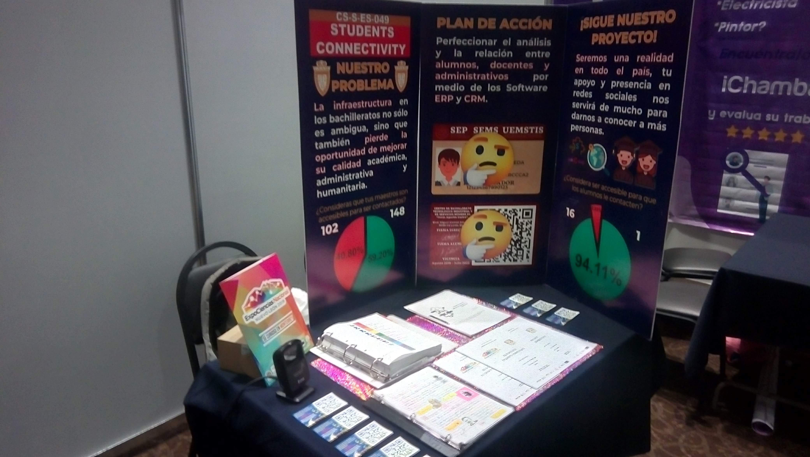

# OpenEducationData

> "Information is the oil of the 21st century, and analytics is the combustion engine."  
> — Peter Sondergaard (Gartner IT Symposium/Xpo, October 2011).

The intelligent collection, cleaning, processing and visualization of data is an indispensable process for the efficient, precise, productive and sharp **self-criticism** of any project. 

A local and international analysis was conducted on the effective collection of information in the Mexican educational sector (with a sample of 10% of students and 25% of teachers at CBTis N°4 in La Laguna, Durango), discovering its precariousness and a notorious discrepancy in communication between students and teachers. 

Its impact has perpetuated the educational deficiency, because even if better pedagogical mechanisms are proposed, there are no objective parameters to evaluate an individual, group, school, region, state or country, and even less in keeping track of its evolution over time.

This project seeks to create a data analysis platform applicable to all high schools (or their equivalences) in Mexico and the world, theoretically based on mathematical resources such as Game Theory, Chaos Theory and Graph Theory, eliminating Gerrymandering practice in academic assessments, enabling real-time public policy assessment, and applying ERP and CRM software concepts.

## Background

This project started as a personal initiative, and had participation in different exhibitions of software projects such as ExpoCiencias Nacional Nuevo León 2019, and was my project to obtain the Líderes del Mañana scholarship from Tec de Monterrey.

