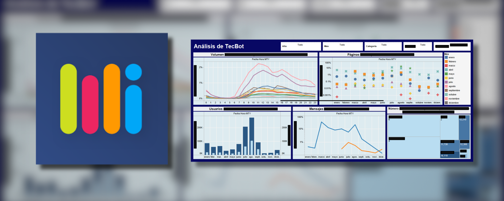

# OpenEducationData

> "Information is the oil of the 21st century, and analytics is the combustion engine."  
> — Peter Sondergaard (Gartner IT Symposium/Xpo, October 2011).

The intelligent collection, cleaning, processing and visualization of data is an indispensable process for the efficient, precise, productive and sharp **self-criticism** of any project. 

This project seeks the decentralized systematization of real-time capture and analysis of educational performance parameters, in order to refine pedagogical policies and strategies at the student, classroom, campus, state and national levels.

## Background

This project started as a personal initiative, and had participation in different exhibitions of software projects such as [ExpoCiencias Nacional Nuevo León 2019](/assets/CS-S-DGO-2357.pdf) (representing UNAM), and was my main project to obtain the Líderes del Mañana scholarship from Tec de Monterrey.

A local and international analysis was conducted on the effective collection of information in the Mexican educational sector (with a sample of 10% of students and 25% of teachers at CBTis N° 04 in La Laguna, Durango), discovering its precariousness and a notorious discrepancy in communication between students and teachers. 

Its impact has perpetuated the educational deficiency, because even if better pedagogical mechanisms are proposed, there are no objective parameters to evaluate the different levels of the educational system, and even less in recording its evolution over time or identify the practice of gerrymandering by mixing social strata.

Includes ideas developed during my collaboration with the student management system MiTec of Tecnologico de Monterrey.

## Current development

> [!IMPORTANT]
> Pending approval and modifications to be treated as Open Source, as intended.

## Future work

- Facilitating export with gganimate.
- Native ggplot2-shiny dashboards.
- Local UX/UI.

## Contact

Feel free to reach out if you have any questions or feedback.

- **Email:** victorbenitogr@gmail.com
- **The subject must start with:**  [OpenEducationData]